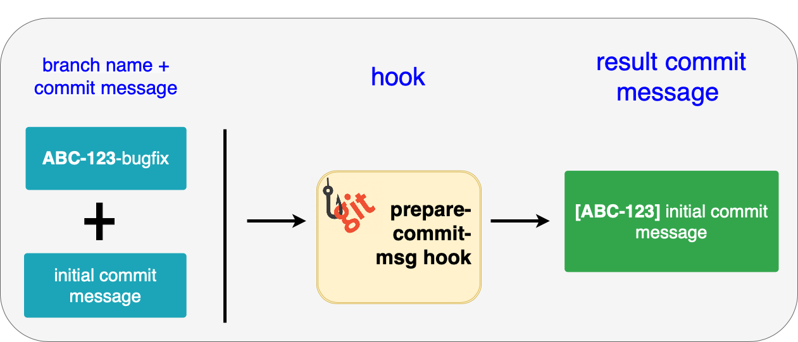

<p align="center">
  <a href="https://github.com/Elanlum/python_git_hooks">
    
  </a>

  <h2 align="center">Simple commit message hooks</h2>

  <p align="center">
    :octocat: :white_check_mark: Contains simple examples of <b>prepare-commit-msg</b>, <b>commit-msg** hooks</b>.
  </p>
<br>


## Description

1. Prepare-commit-msg hook adds a prefix to commit message with Jira ticket from a branch name in brackets 
(ex. ```ABC-123-bugfix -> [ABC-123] initial commit msg```).

To be triggered by hook branch name contains a substring that complies with pattern: `````^[A-Z]{1,9}-[0-9]{1,9}`````

The diagram below shows the workflow of the prepare-commit-msg hook.


2. Commit-msg hook is intended to help developers to formalize commit messages. It checks typed commit message for the presence of the specified template and declines commit if message doesn't correspond to the template.

## Getting Started

### Dependencies

* Python 3 insalled
* Windows 10 or Mac OS 11
* Git 2.3

### Installing

#### Mac OS

* Download file with hook - **python script**
* For Python hook you're also going to need Python 3 installed (Mac has it out of the box, but on Windows you have to set it up manually).
* Make sure filename is **prepare-commit-msg** or **commit-msg**
* Make chosen file executable using **chmod +x prepare-commit-msg** (on Windows works via Git Bash just fine) or **chmod 755 prepare-commit-msg**
* Put the file into every project you want to use githook for. Destination folder looks like: **your_project/.git/hooks**
* Alternatively, you can **specify general folder** for git to look for hooks instead of putting them into every project .git/hooks folder.

Use command below with path to your global hooks directory

```git config --global core.hooksPath /usr/local/.../git/hooks```

Now if you execute

```git config --global --list```

<ins>You're breathtaking!</ins>

#### Windows

* Download pairs of hooks from windows **directory**
* Copy them into **your_project/.git/hooks** directoty
* Do not forget to make files executable

### Executing

Git hooks are triggered automatically if they are located in .git directory in your repository or in global folder (see above for instruction).

## Help

In case any problems occur check every step of the installation process.

## Authors

Roman Gorbatenko  
[@Elanlum](roman.gorabtenko@gmail.com)
